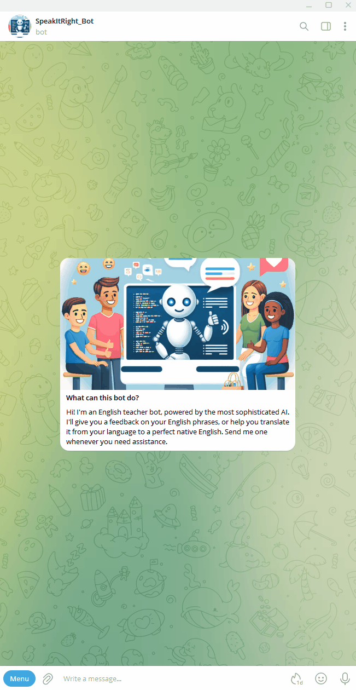

# Welcome to the Azure OpenAI-Powered Telegram Bot Workshop Guide! 🤖✨

Hello and welcome, bot enthusiasts and developers alike!

This comprehensive guide serves as your roadmap to creating your very own Azure OpenAI-powered bot. Whether you're a seasoned developer or just diving into the world of AI, this workshop guide is designed to provide you with detailed instructions and resources every step of the way.

The bot we will be creating serves as a language teaching assistant. Its primary function is to help you improve your grammar and sound more fluent, almost like a native speaker. This bot does more than just correct your grammar - it explains the reasoning behind each correction. 

Additionally, it has the capability to translate your phrases from any supported language to your desired one. You can interact with the bot in natural language, asking it to adjust the tone or make it shorter, etc. 

By default, the bot translates to English, but you can change this setting to any language currently supported by OpenAI. The bot's prompt is fully customizable, allowing you to create an assistant with a different scenario. The possibilities are endless!

Here is a recorded demo of the bot:

In this guide, you will discover:

- **Prerequisites**: Essential requirements before you start.
- **Step-by-step guidance**: Detailed instructions on creating and configuring the necessary Azure resources, including storage accounts, functions, and more.
- **Github and VSCode usage**: Comprehensive guide on how to use Github and VSCode to create, modify, and update your bot.
- **Troubleshooting advice and common pitfalls**: Useful tips to avoid common mistakes and solve problems (coming soon).

Whether you're looking to build a chatbot, virtual assistant, or something entirely unique, this guide has you covered. Get ready to unleash the power of Azure OpenAI and take your bot-building skills to the next level!

Let's embark on this exciting journey together. Happy coding! 🚀

# Part 0: Prerequisites

Before we start, there are a few things you need to have and do:

1. **Azure Subscription**: Ensure you have an Azure subscription that belongs to a *Company*. Currently, access to the OpenAI service can only be requested for corporate subscriptions. Personal subscriptions or emails will not be approved. If you are a Microsoft Employee and don’t have one yet, follow this [guide](https://dev.azure.com/OneCommercial/NoCode/_wiki/wikis/NoCode.wiki/74/Managed-Azure-Tenant-Environment) to get a Microsoft Internal Subscription.

2. **Request Access to Azure OpenAI**: Fill out this form to request access to Azure OpenAI: [Request Access to OpenAI Service](https://customervoice.microsoft.com/Pages/ResponsePage.aspx?id=v4j5cvGGr0GRqy180BHbR7en2Ais5pxKtso_Pz4b1_xUNTZBNzRKNlVQSFhZMU9aV09EVzYxWFdORCQlQCN0PWcu). Please note that this is only available for corporate subscriptions and emails. The approval process may take a couple of days, so I recommend getting this done as soon as possible. When filling out the form, make sure to check all four available Azure OpenAI service features in question 17.

3. **Software Installation**: Download and install the following software:
    - Git: [Download here](https://git-scm.com/download)
    - Visual Studio Code: [Download here](https://code.visualstudio.com/download)

4. **GitHub Account**: If you don’t already have a GitHub account, you can create one [here](https://github.com/).

5. **Telegram Account**: Install the Telegram app and sign up if you do not have an account yet. You can download the app from [here](https://telegram.org/).

6. **Allow Running of Unsigned Scripts**: Start PowerShell with the "Run as Administrator" option and run the following command to allow the execution of unsigned scripts: `Set-ExecutionPolicy RemoteSigned`. This is necessary for running certain scripts in your local development environment.

# Part 1: Cloning the Repository and preparing VSCode

1. **Locate the Fork Button**: On the top right corner of the repository (this page), you'll see a button labeled "Fork." It's next to the "Watch" and "Star" buttons.

2. **Click Fork**: Click on the "Fork" button. This action will create a copy of the repository under your GitHub account.

3. **Choose the Destination**: A dialog will appear asking where you want to fork the repository. Choose your user account or any organization you're a member of where you want to fork the repository.

4. **Wait for the Fork to Complete**: GitHub will start the process of forking the repository. Depending on the size of the repository, this process may take a few moments.

5. **Confirm Fork Creation**: Once the forking process is complete, you'll be redirected to the forked repository under your GitHub account. You should see a message indicating that the fork was successful.

6. **Clone Your Fork**: In order to work on the forked repository locally, you should clone it to your local machine using Git. Click on the green "Code" button and copy the repository URL. 

7. Open VS Code, go to **'View'**, then **'Command Palette'**, and type **'Git: Clone'**

8. Enter the repository URL you copied: `https://github.com/sergeypechenkin/SpeakItRight-bot`, click **'Clone From URL'**

9. Choose a folder on your computer to use as the local Git repository

10. Click '**Open the folder in VSCode**'

That's it! You've successfully forked the repository and can now start making changes to it. Remember, the forked repository is independent of the original repository, so you can make changes without affecting the original project. If you want to contribute your changes back to the original repository, you can do so by creating a pull request.

### Install VSCode extensions:
- Python
- Azure Function

Visual Studio Code (VS Code) extensions are like add-ons or plugins that enhance the functionality of the VS Code editor. They allow you to customize and tailor your coding experience to better suit your needs. 

### Rename example-local.settings.json to local.settings.json
File `local.settings.json` will not be uploaded to the Github repository to prevent a leakage of your secrets

### Create virtual environment:
1. Go to **'View'**, then **'Command Palette'**, and type **'Python: Create environment'**
2. Choose '**Venv**' -> select '**Python x.xx**'
3. Check box on `requirements.txt` to install dependencies, click **'Ok'**

That's it! You've successfully created and activated a virtual environment for your Python project. You can now work on your project within the isolated environment without affecting your system-wide Python installation.
You can activate this environment by opening a project's folder in VSCode and running `.venv\Scripts\activate` script. 
If you don't have a Terminal opened, click '**Terminal**' ->  '**New Terminal**' 

# Part 2: Creating Azure resources

| Azure Resource type      | Name (example)        | Comments                                                                                                                  |
|--------------------|------------------------|---------------------------------------------------------------------------------------------------------------------------|
| Resource group     | OpenAIBot1-PRD-EUN-rg |  Set the region nearest to you for all resources, except those from OpenAI        |
| Storage account    | openaibot1sa001dsfwd   | storage account names must be between 3 and 24 characters in length and may contain numbers and lowercase letters only. Your storage account name must be unique within Azure                                                                                                                          |
|                    |                        |Go to Storage Account created, Security & Network -> Access Keys -> Show and Copy Connection string. Put it in the local.settings.json
| SA blob container  | history                |Go to Data Storage -> Containers and click '**+ Container**'                  |
| Function           | OpenAIBot1-PRD-NEU-func     | Settings - Python, 3.11, NEU , Serverless = eventrdiven.  |
| Azure OpenAI       | Openaibot-prd-cae-openai | Check email from csgate@microsoft.com for the Region (We are pleased to inform you that you have been onboarded to Azure OpenAI Service GPT-4 in the CanadaEast region.)  
|||Go to Keys and Deployments and copy Key1 and Endpoint to your local.settings.json.  
|||If you don't have access -  submit this form to request access to OpenAI. [Request Access to OpenAI Service](https://customervoice.microsoft.com/Pages/ResponsePage.aspx?id=v4j5cvGGr0GRqy180BHbR7en2Ais5pxKtso_Pz4b1_xUNTZBNzRKNlVQSFhZMU9aV09EVzYxWFdORCQlQCN0PWcu). Corporate subscription and email only. It may take a few days to complete    |
| Open AI Model      | gpt-4     | Go to Azure OpenAI you created, Model Deployments and click Manage Deployments. Click Create new deployment.   Model - gpt-4 1106-Preview, Standard, name gpt-4 (hardcoded in the app) |

# Part 3: Deploying your application into Azure Function

1. Go to **'View'**, then **'Command Palette'**, and type '**Azure Functions: Deploy to Azure Function App**'. Sign-in to your Azure account (if not done yet). Choose your '**Subscription**', then choose you '**Function**'. Click `Deploy`. This will overwrite previous application version, if any.  

2. Now we need to get a URL of the application we deployed. 
Go to **'View'**, then **'Command Palette'**, and type '**Azure Functions: Copy Function URL**'. Again, choose your '**Subscription**', '**Function**' and application itself `http_trigger` by default. Paste the URL in the notepad, we will need it later. 

# Part 3: Setting Up Telegram

Follow these steps to set up your bot on Telegram:

1. Search for the contact `Botfather` (it has a blue checkmark).
2. Send the message `/newbot`. You'll be prompted to provide a **name** for the bot. This is the display name that others will see in chats and channels. You can choose any name you like, and you can change it at any time.
3. Next, you'll need to provide a **username** for the bot. This is a unique identifier that starts with "@" and will be used for your bot's profile URL. It should be easy for others to find and mention. Once set, it can't be changed or reused. Make sure it ends with the word `'bot'`.
4. After you've set the name and username, you'll receive an HTTP API access token. Copy this token and paste it into your `local.settings.json` file. Also, save it in a notepad temporarily as you'll need it later.

5. Now, you need to set a webhook that points to our Azure Function app. We will use the Telegram Bot API for this. The command you need is: `https://api.telegram.org/bot<token>/setWebhook?url={function_url}`. Replace `<token>` with your Telegram API token and `{function_url}` with your Function URL. For example, if your URL is `https://func1-tg-partybot-3111hb.azurewebsites.net/api/http_trigger` and your token is `6255927130:AAFn8efklsgvy35TYk5MqWwFULknbanF3Js`, your request will look like this:

    `https://api.telegram.org/bot6255927130:AAFn8efklsgvy35TYk5MqWwFULknbanF3Js/setWebhook?url=https://func1-tg-partybot-3111hb.azurewebsites.net/api/http_trigger`

6. Copy this request, paste it into your browser's address bar, and press Enter. If the request is constructed correctly, you should see a message saying `"description": "Webhook was set"`.

7. You can check the webhook setting by making another request: `https://api.telegram.org/bot<token>/getWebhookInfo`

# Part 4: VS Code - uploading app settings to Azure Function

This marks the final stage of our workshop. 
Our application has been successfully deployed. Now, it's time to configure all the settings we've defined in the `local.settings.json` file.

1. Ensure that all settings in your `local.settings.json` are correctly set and **saved**.
2. Go to **'View'**, then **'Command Palette'**, and type **'Azure functions: Upload local settings'**. Select your '**Subscription**' and '**Function**'  

# Congratulations! 🎉 Your bot is now up and running, ready to serve its purpose! Now, it's time to put it to the test.

1. **Open Telegram**: Launch the Telegram app on your device.

2. **Find Your Bot**: In the search bar, type `@mybotuniquename` (replace `mybotuniquename` with your bot's actual username).

3. **Start Chatting**: Once you've found your bot, start a chat with it by clicking on its name. You can now interact with your bot just like you would with any other contact on Telegram!

4. **Test Your Bot**: Try out the commands or actions you've programmed your bot to handle. Whether it's answering questions, providing information, or executing tasks, see how your bot performs in action.

5. **Customize and Iterate**: As you test your bot, take note of any improvements or additional features you'd like to add. Remember, building a bot is an iterative process, so don't hesitate to refine and enhance it based on user feedback and your own observations.

That's it! You've successfully created and deployed your own Telegram bot. I hope you enjoy using it and find it useful for your needs. Happy botting! 🤖✨

